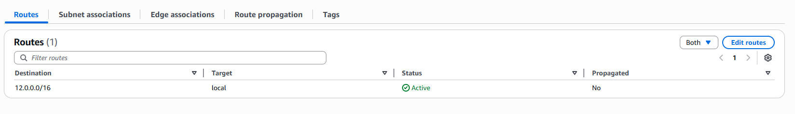
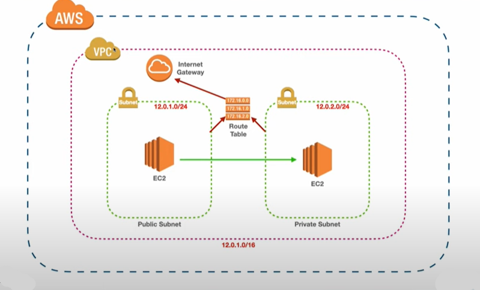
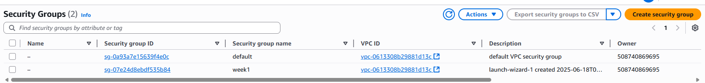

# VPC Setup Guide

This guide walks you through creating a custom Virtual Private Cloud (VPC) with public and private EC2 instances on AWS. Below are the key steps and their corresponding diagrams/screenshots.

---

## 1. Design the Architecture

---

## 2. Create a VPC

---

## 3. Create an Internet Gateway (IGW)

---

## 4. Create Public and Private Subnets

---

## 5. Create Route Tables

---

## 6. Edit Route Table for Internet Access

---

## 7. Launch EC2 in Public Subnet

---

## 8. Launch EC2 in Private Subnet

---

## Additional Diagrams & Screenshots

---

> **Note:** All images above were extracted from the original Word document. If you need the full context or step-by-step instructions, please refer to the original `VPC-Setup.docx` file. 